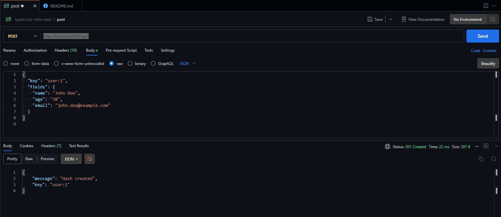
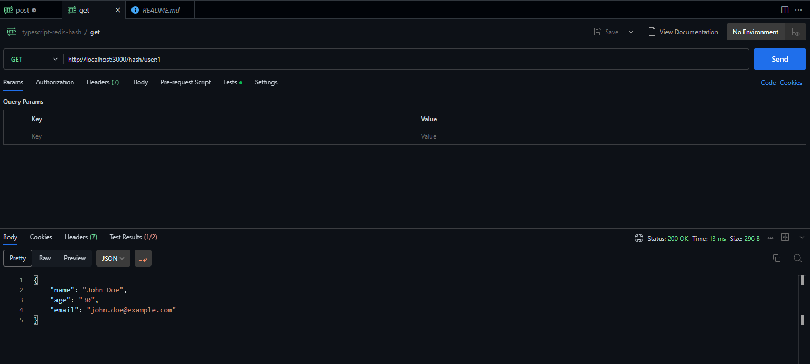
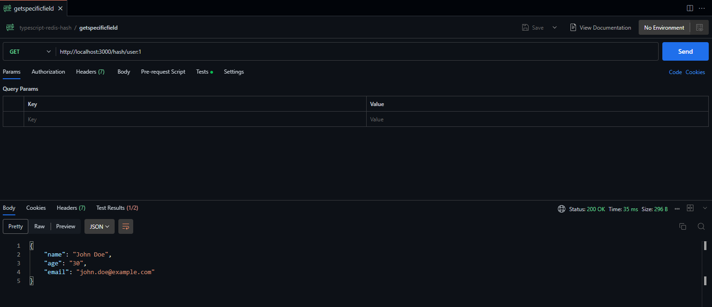
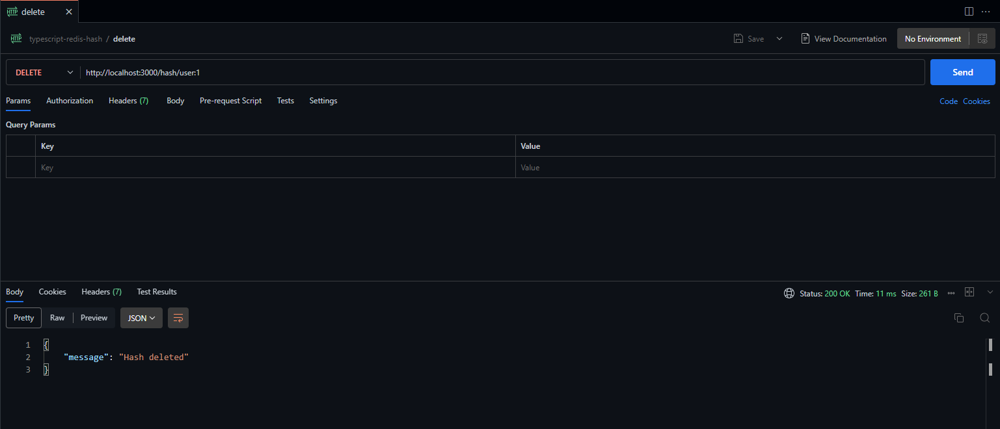

<p>
  
  <a href="https://www.typescriptlang.org/">
    
  </a>
    <a href="https://redis.io/">
    
  </a>
</p>


# Índice 

* [Objetivo](#objetivo)
* [Tecnologias Utilizadas](#tecnologias-utilizadas)
* [Redis](#redis)
* [Vantagens Hashes](#vantagens-hashes)


```ts
PROJETO-TS-REDIS-2/
├── dist/
│   ├── hashController.js
│   ├── index.js
│   ├── routes.js
├── node_modules/
├── src/
├── .gitignore
├── docker-compose.yml
├── Dockerfile
├── package-lock.json
├── package.json
├── README.md
├── redis.conf
├── tsconfig.json

```

## Objetivo

Para a branch desse projeto chamada `main`, a ideia e usar os recursos do `redis` para conhecer as funcionalidades e seus usos para o objeto `hash`.

Os hashes no `redis` são estruturas de dados muito úteis para armazenar e gerenciar conjuntos de campos e valores associados a uma chave específica. Eles são frequentemente usados em cenários onde você precisa representar objetos, entidades ou coleções compactas de dados. Aqui estão os usos mais comuns para os hashes do Redis:

- 1. Armazenar objetos ou modelos

Hashes são ideais para representar objetos ou entidades, onde cada campo representa um atributo da entidade. Por exemplo: armazenar informações de um usuário

```powershell

HMSET user:1001 name "Alice" age "30" email "alice@example.com"

```

Campos como `name`, `age` e `email` representam atributos do usuário.

- 2. Cache de objetos ou dados

Hashes são frequentemente usados para armazenar resultados de consultas de banco de dados ou APIs em cache, tornando a recuperação de dados mais rápida. Por exemplo: cache de um perfil de usuário

```powershell

HMSET user:cache:1001 name "Alice" age "30" email "alice@example.com"

```

- 3. Contadores agrupados

Você pode usar hashes para armazenar múltiplos contadores agrupados por categoria ou tipo.

Por exemplo: contadores de visitas por páginas

```powershell

HINCRBY page:views home 1
HINCRBY page:views about 1

```

Os campos `home` e `about` armazenam o número de visitas para cada página.

- 4. Configurações ou preferências de aplicação

Armazene as configurações de um sistema ou preferências de um usuário em um hash.

Por exemplo: configurações de um usuário:

```powershell

HMSET settings:1001 theme "dark" notifications "enabled" language "en"

```

- 5. Representação de cetas de compras

Hashes podem ser usados para representar cestas de compras, onde os campos são identificadores de produtos e os valores representam as quantidades.

```powershell

HMSET cart:1001 product:101 2 product:102 1

```

Aqui, o campo `product:101` armazena a quantidade de 2 unidades do produto com ID 101.

- 6. Gerenciamento de sessões

Armazene informações de sessão do usuário, como tokens, IDs, ou timestamps.

```powershell

HMSET session:abc123 user_id "1001" login_time "1672531200"

```

- 7. Armazenar estatísticas e métricas

Hashes podem ser usados para registrar estatísticas em tempo real, como desempenho de aplicações ou uso de recursos.

Por exemplo: estatísticas de um servidor

```powershell

HMSET server:stats cpu "45%" memory "60%" disk "80%"

```

- 8. Armazenar dados estruturados em mensagens

Se você estiver trabalhando com filas ou mensagens (como em Redis Streams ou Pub/Sub), os hashes podem ser usados para representar os dados estruturados de cada mensagem.

Por exemplo: representação de uma mensagem

```powershell

HMSET message:101 sender "Alice" receiver "Bob" content "Hello, Bob!"

```

- 9. Gerenciamento de inventário

Hashes podem representar o estoque de itens em um sistema de gerenciamento de inventário.

Por exemplo: estoques de produtos

```powershell

HMSET inventory:store_1 item:101 50 item:102 30

```

Os campos representam IDs de itens e os valores, suas quantidades.

- 10. Agrupamento de tags ou relacionamentos

Hashes podem ser usados para associar várias tags ou relacionamentos a uma chave única.

Por exemplo: tags associadas a um post

```powershell

HMSET post:tags:1001 tag1 "Redis" tag2 "Database" tag3 "NoSQL"

```

- 11. Armazenar dicionários de tradução

Usar hashes para armazenar traduções de textos para diferentes idiomas.

Por exemplo: traduções de uma palavra

```powershell

HMSET translation:hello en "Hello" es "Hola" fr "Bonjour"


```

## Tecnologias Utilizadas

- `Typescript`
- `Docker`
- `Javascript`
- `Redis` e `Redis Insight`
- `React`

## Redis

O `redis` não é suportado oficialmente pelo `windows`, logo você primeiro precisará o `wsl2`. Acesse esse [link](https://learn.microsoft.com/en-us/windows/wsl/install) para maiores informações em como proceder com essa instalação.

## Instruções para rodar esse projeto

- 1. Clonar o repositório (usar a branch main):

```powershell

git clone https://github.com/andresalerno/projeto-ts-redis.git .

```

- 2. Mudar para a branch redis-hash

```powershell

git checkout redis-hash


- 3. Instalar as dependências necessárias

```powershell

npm install

```

- 4. Transpilar para typescript

```powershell

tsc

```

- 5. Rodar o docker-compose

```powershell

docker-compose up --build

```

## Postman

Para a realização do teste com o `postman` você deve seguir os seguintes passos:

a) Método POST



b) Método GET



c) Método GEST (specific)



d) Método PATCH


e) Método DELETE



## Vantagens Hashes

- Eficiência: Consome menos memória para armazenar múltiplos campos.
- Acesso rápido: Operações como HGET, HSET e HMGET permitem acesso a campos específicos sem carregar toda a estrutura.
- Flexibilidade: Perfeito para modelar objetos e dados dinâmicos.
- Hashes são amplamente usados por causa da sua simplicidade e flexibilidade em diversos cenários!